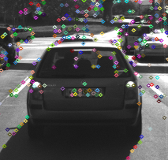
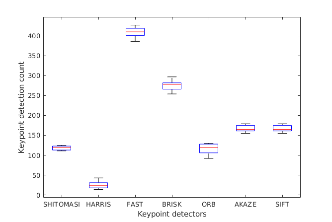
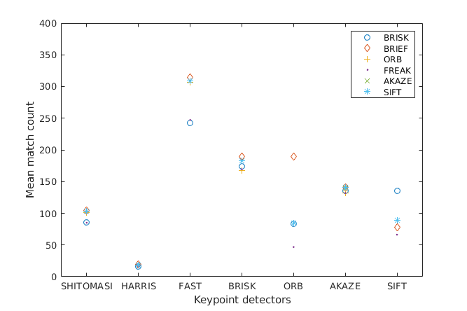
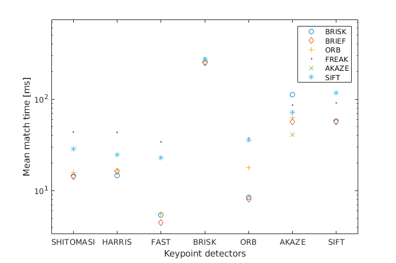

# SFND 2D Feature Tracking


The idea of the camera course is to build a collision detection system - that's the overall goal for the Final Project. As a preparation for this, you will now build the feature tracking part and test various detector / descriptor combinations to see which ones perform best. This mid-term project consists of four parts:

* First, you will focus on loading images, setting up data structures and putting everything into a ring buffer to optimize memory load. 
* Then, you will integrate several keypoint detectors such as HARRIS, FAST, BRISK and SIFT and compare them with regard to number of keypoints and speed. 
* In the next part, you will then focus on descriptor extraction and matching using brute force and also the FLANN approach we discussed in the previous lesson. 
* In the last part, once the code framework is complete, you will test the various algorithms in different combinations and compare them with regard to some performance measures. 

See the classroom instruction and code comments for more details on each of these parts. Once you are finished with this project, the keypoint matching part will be set up and you can proceed to the next lesson, where the focus is on integrating Lidar points and on object detection using deep-learning. 

## Dependencies for Running Locally
* cmake >= 2.8
  * All OSes: [click here for installation instructions](https://cmake.org/install/)
* make >= 4.1 (Linux, Mac), 3.81 (Windows)
  * Linux: make is installed by default on most Linux distros
  * Mac: [install Xcode command line tools to get make](https://developer.apple.com/xcode/features/)
  * Windows: [Click here for installation instructions](http://gnuwin32.sourceforge.net/packages/make.htm)
* OpenCV >= 4.1
  * This must be compiled from source using the `-D OPENCV_ENABLE_NONFREE=ON` cmake flag for testing the SIFT and SURF detectors.
  * The OpenCV 4.1.0 source code can be found [here](https://github.com/opencv/opencv/tree/4.1.0)
* gcc/g++ >= 5.4
  * Linux: gcc / g++ is installed by default on most Linux distros
  * Mac: same deal as make - [install Xcode command line tools](https://developer.apple.com/xcode/features/)
  * Windows: recommend using [MinGW](http://www.mingw.org/)

## OpenCV version
* This code was developed using the latest OpenCV master where SIFT has ben moved from the non-free repository to the main package.
* This means that all mentions of `SIFT` have to be replaced with `xfeatures2d::SIFT` if using an eariler version.

## Basic Build Instructions

1. Clone this repo.
2. Make a build directory in the top level directory: `mkdir build && cd build`
3. Compile: `cmake .. && make`
4. Run it: `./2D_feature_tracking`.


## Mid-Term Report

### MP.1  Data buffer Optimization

**Requirement:** Implement a vector for dataBuffer objects whose size does not exceed a limit (e.g. 2 elements). This can be achieved by pushing in new elements on one end and removing elements on the other end.

```cpp
DataFrame frame;
frame.cameraImg = imgGray;
if(dataBuffer.size() < dataBufferSize){  
  dataBuffer.push_back(frame);
}else{
  dataBuffer.erase(dataBuffer.begin());
  dataBuffer.push_back(frame);
}
```

### MP.2 Keypoint Detection

**Requirement:** Implement detectors HARRIS, FAST, BRISK, ORB, AKAZE, and SIFT and make them selectable by setting a string accordingly.

```cpp
double detKeypointsModern(std::vector<cv::KeyPoint> &keypoints, cv::Mat &img, std::string detectorType, bool bVis)
{
    double t = (double)cv::getTickCount();
    cv::Ptr<cv::FeatureDetector> detector;

    if (detectorType.compare("FAST") == 0)
    {
        detector = cv::FastFeatureDetector::create();
    }
    else if (detectorType.compare("BRISK") == 0)
    {
        detector = cv::BRISK::create();
    }
    else if (detectorType.compare("ORB") == 0)
    {
        detector = cv::ORB::create();
    }
    else if (detectorType.compare("AKAZE") == 0)
    {
        detector = cv::AKAZE::create();
    }
    else if (detectorType.compare("SIFT") == 0)
    {
        detector = cv::SIFT::create();
    }
    detector->detect(img, keypoints);
    t = ((double)cv::getTickCount() - t) / cv::getTickFrequency();
    cout << detectorType << " detection with n=" << keypoints.size() << " keypoints in " << 1000 * t / 1.0 << " ms" << endl;

    // visualize results
    if (bVis)
    {
        cv::Mat visImage = img.clone();
        cv::drawKeypoints(img, keypoints, visImage, cv::Scalar::all(-1), cv::DrawMatchesFlags::DRAW_RICH_KEYPOINTS);
        string windowName = detectorType + " Detector Results";
        cv::namedWindow(windowName, 6);
        imshow(windowName, visImage);
        cv::waitKey(0);
    }
    return 1000.0 * t;
}

double detKeypointsHarris(std::vector<cv::KeyPoint> &keypoints, cv::Mat &img, bool bVis)
{
     // Detector parameters
    int blockSize = 2;     // for every pixel, a blockSize × blockSize neighborhood is considered
    int apertureSize = 3;  // aperture parameter for Sobel operator (must be odd)
    int minResponse = 100; // minimum value for a corner in the 8bit scaled response matrix
    double k = 0.04;       // Harris parameter (see equation for details)
    double t = (double)cv::getTickCount();

    // Detect Harris corners and normalize output
    cv::Mat dst, dst_norm;
    dst = cv::Mat::zeros(img.size(), CV_32FC1);
    cv::cornerHarris(img, dst, blockSize, apertureSize, k, cv::BORDER_DEFAULT);
    cv::normalize(dst, dst_norm, 0, 255, cv::NORM_MINMAX, CV_32FC1, cv::Mat());

    // Look for prominent corners and instantiate keypoints
    double maxOverlap = 0.0; // max. permissible overlap between two features in %, used during non-maxima suppression
    for (size_t j = 0; j < dst_norm.rows; j++)
    {
        for (size_t i = 0; i < dst_norm.cols; i++)
        {
            int response = (int)dst_norm.at<float>(j, i);
            if (response > minResponse)
            { // only store points above a threshold

                cv::KeyPoint newKeyPoint;
                newKeyPoint.pt = cv::Point2f(i, j);
                newKeyPoint.size = 2 * apertureSize;
                newKeyPoint.response = response;

                // perform non-maximum suppression (NMS) in local neighbourhood around new key point
                bool bOverlap = false;
                for (auto it = keypoints.begin(); it != keypoints.end(); ++it)
                {
                    double kptOverlap = cv::KeyPoint::overlap(newKeyPoint, *it);
                    if (kptOverlap > maxOverlap)
                    {
                        bOverlap = true;
                        if (newKeyPoint.response > (*it).response)
                        {                      // if overlap is >t AND response is higher for new kpt
                            *it = newKeyPoint; // replace old key point with new one
                            break;             // quit loop over keypoints
                        }
                    }
                }
                if (!bOverlap)
                {                                     // only add new key point if no overlap has been found in previous NMS
                    keypoints.push_back(newKeyPoint); // store new keypoint in dynamic list
                }
            }
        } // eof loop over cols
    }     // eof loop over rows

    t = ((double)cv::getTickCount() - t) / cv::getTickFrequency();
    cout << "Harris detection with n=" << keypoints.size() << " keypoints in " << 1000 * t / 1.0 << " ms" << endl;

    // visualize results
    if (bVis)
    {
        cv::Mat visImage = img.clone();
        cv::drawKeypoints(img, keypoints, visImage, cv::Scalar::all(-1), cv::DrawMatchesFlags::DRAW_RICH_KEYPOINTS);
        string windowName = "Harris Corner Detector Results";
        cv::namedWindow(windowName, 6);
        imshow(windowName, visImage);
        cv::waitKey(0);
    }
    return 1000.0 * t;
}

```

### MP.3 Keypoint Removal

**Requirement:** Remove all keypoints outside of a pre-defined rectangle and only use the keypoints within the rectangle for further processing.

```cpp
cv::Rect vehicleRect(535, 180, 180, 150);
vector<cv::KeyPoint> keypoints_vehicle;
if (bFocusOnVehicle){
    for(auto &keypoint : keypoints)
    {
        if (vehicleRect.contains(keypoint.pt)){
            keypoints_vehicle.push_back(keypoint);
        }
    }
    keypoints =  keypoints_vehicle;
}
```

### MP.4 Keypoint Descriptors

**Requirement:** Implement descriptors BRIEF, ORB, FREAK, AKAZE and SIFT and make them selectable by setting a string accordingly.

```cpp
/ Use one of several types of state-of-art descriptors to uniquely identify keypoints
// BRISK, BRIEF, ORB, FREAK, AKAZE, SIFT
double descKeypoints(vector<cv::KeyPoint> &keypoints, cv::Mat &img, cv::Mat &descriptors, string descriptorType)
{
    // select appropriate descriptor
    cv::Ptr<cv::DescriptorExtractor> extractor;
    if (descriptorType.compare("BRISK") == 0)
    {

        int threshold = 30;        // FAST/AGAST detection threshold score.
        int octaves = 3;           // detection octaves (use 0 to do single scale)
        float patternScale = 1.0f; // apply this scale to the pattern used for sampling the neighbourhood of a keypoint.

        extractor = cv::BRISK::create(threshold, octaves, patternScale);
    }
    else if (descriptorType.compare("BRIEF") == 0)
    {
        extractor = cv::xfeatures2d::BriefDescriptorExtractor::create();
    }
    else if (descriptorType.compare("ORB") == 0)
    {
        extractor = cv::ORB::create();
    }
    else if (descriptorType.compare("FREAK") == 0)
    {
        extractor = cv::xfeatures2d::FREAK::create();
    }
    else if (descriptorType.compare("AKAZE") == 0)
    {
        extractor = cv::AKAZE::create();
    }
    else if (descriptorType.compare("SIFT") == 0)
    {
        extractor = cv::SIFT::create();
    }

    // perform feature description
    double t = (double)cv::getTickCount();
    extractor->compute(img, keypoints, descriptors);
    t = ((double)cv::getTickCount() - t) / cv::getTickFrequency();
    cout << descriptorType << " descriptor extraction in " << 1000 * t / 1.0 << " ms" << endl;
    return 1000.0 * t;
}
```

### MP.5 Descriptor Matching

**Requirement:** Implement FLANN matching as well as k-nearest neighbor selection. Both methods must be selectable using the respective strings in the main function.

```cpp
void matchDescriptors(std::vector<cv::KeyPoint> &kPtsSource, std::vector<cv::KeyPoint> &kPtsRef, cv::Mat &descSource, cv::Mat &descRef,
                      std::vector<cv::DMatch> &matches, std::string descriptorType, std::string matcherType, std::string selectorType)
{
    // configure matcher
    bool crossCheck = false;
    cv::Ptr<cv::DescriptorMatcher> matcher;

    if (matcherType.compare("MAT_BF") == 0)
    {
        int normType = descriptorType.compare("DES_BINARY") == 0 ? cv::NORM_HAMMING : cv::NORM_L2;
        matcher = cv::BFMatcher::create(normType, crossCheck);
    }
    else if (matcherType.compare("MAT_FLANN") == 0)
    {
        if (descSource.type() != CV_32F)
        { // OpenCV bug workaround : convert binary descriptors to floating point due to a bug in current OpenCV implementation
            descSource.convertTo(descSource, CV_32F);
            descRef.convertTo(descRef, CV_32F);
        }
        matcher = cv::DescriptorMatcher::create(cv::DescriptorMatcher::FLANNBASED);
    }

    // perform matching task
    if (selectorType.compare("SEL_NN") == 0)
    { // nearest neighbor (best match)

        matcher->match(descSource, descRef, matches); // Finds the best match for each descriptor in desc1
    }
    else if (selectorType.compare("SEL_KNN") == 0)
    { // k nearest neighbors (k=2)

        vector<vector<cv::DMatch>> knn_matches;
        matcher->knnMatch(descSource, descRef, knn_matches, 2); // finds the 2 best matches
        // filter matches using descriptor distance ratio test
        double minDescDistRatio = 0.8;
        for (auto it = knn_matches.begin(); it != knn_matches.end(); ++it)
        {
            if ((*it)[0].distance < minDescDistRatio * (*it)[1].distance)
            {
                matches.push_back((*it)[0]);
            }
        }
    }
}
```


### MP.6 Descriptor Distance Ratio

**Requirement:** Use the K-Nearest-Neighbor matching to implement the descriptor distance ratio test, which looks at the ratio of best vs. second-best match to decide whether to keep an associated pair of keypoints.

See function block above.

### MP.7 Performance Evaluation 1

**Requirement:** Count the number of keypoints on the preceding vehicle for all 10 images and take note of the distribution of their neighborhood size. Do this for all the detectors you have implemented.




| Detector   | Mean keypoint size | Mean count | Distribution on preceeding vehicle       |
|------------|--------------------|------------|------------------------------------------|
| SHI-TOMASI | 4 pixels           | 117.9      | Most on sign and car seats               |
| HARRIS     | 6 pixels           | 24.8       | Lights and car seats                     |
| FAST       | 7 pixels           | 409.4      | Good spead on both sign and edges of car |
| BRISK      | 7 pixels           | 276.2      | Most along car edges                     |
| ORB        | 55.6 pixels        | 116.1      | Most along car edges                     |
| AKAZE      | 7 pixels           | 167        | Most along car edges                     |
| SIFT       | 4.4 pixels         | 138.6      | Both car edges and sign                  |

In the following figure, the spread of detection counts on the predeeding vehicle is plotted. 


### MP.8 Performance Evaluation 2

**Requirement:** Count the number of matched keypoints for all 10 images using all possible combinations of detectors and descriptors. In the matching step, the BF approach is used with the descriptor distance ratio set to 0.8.

In the figure below, the mean match count from 10 images is shown for all combinations of detectors and descriptors. Note that SIFT+ORB did't run due to Out-Of-Memory, and only the AKAZE detector work with the AKAZE descriptor.



### MP.9 Performance Evaluation 3

**Requirement:** Log the time it takes for keypoint detection and descriptor extraction. The results must be entered into a spreadsheet and based on this data, the TOP3 detector / descriptor combinations must be recommended as the best choice for our purpose of detecting keypoints on vehicles.

The last figure show the total mean detection+match time from 10 images for all combination of detectors and descriptors. As with the case above, SIFT+ORB did't run due to Out-Of-Memory, and only the AKAZE detector work with the AKAZE descriptor.




From the results above we can conclude that the 3 best combinations of detectors and descriptor are as listed in the following table, based on most matches on preceeding vehicle and lowest match time.
|   | Detector+Descriptor | Mean match count | Mean match time [ms] |
|---|---------------------|------------------|----------------------|
| 1 | FAST+BRIEF          | 314.6            | 4.41                 |
| 2 | FAST+ORB            | 306.9            | 5.56                 |
| 3 | FAST+BRISK          | 242.6            | 5.45                 |


